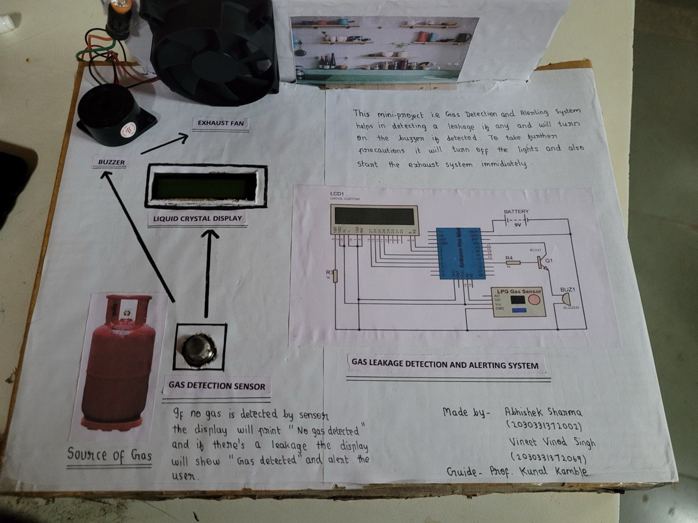

# 🛠️ Gas Leakage Detection and Alerting System 🛠️

## 📖 Overview
Gas leakage can lead to various accidents, resulting in material loss and human injuries. This project presents a system to detect LPG leakage and alert the relevant personnel to prevent such accidents. The system uses an Arduino Uno, MQ2 gas sensor, and other components to detect and alert users of gas leakage.

## 🚀 Features
- **Real-time Gas Detection**: Detects LPG, propane, methane, and other gases.
- **Immediate Alerts**: Activates an alarm and sends SMS alerts upon detection of gas leakage.
- **Safety Measures**: Prevents potential explosions and ensures house safety.

## 🧰 Components
- Arduino Uno
- MQ2 Gas Sensor
- Alphanumeric LCD 16x2
- Buzzer
- GSM Module
- Power Supply
- Connecting Wires

## 🛠️ System Design
### Block Diagram

### Description
1. **Arduino Uno**: The microcontroller board used to control the system.
   
2. **MQ2 Gas Sensor**: Detects gas concentrations.
   ]
3. **Alphanumeric LCD 16x2**: Displays system status and gas concentration.
   
4. **Buzzer**: Emits sound in case of gas detection.
   
5. **GSM Module**: Sends SMS alerts.
  

## 📷 Photos and Videos
### Photos
- System Overview
  

### Video Demonstrations
- [Project Demo](Media/gas-leakage.mp4)

## 📜 How to Use
1. **Setup the Hardware**: Connect all components as per the block diagram.
2. **Upload the Code**: Use Arduino IDE to upload the provided code to the Arduino Uno.
3. **Power the System**: Use the power supply to power the system.
4. **Monitor and Respond**: The system will continuously monitor for gas leakage and alert you if any is detected.

## 🛡️ Safety Precautions
- Ensure proper ventilation in the area where the system is installed.
- Regularly check the sensors and other components for any faults.
- Do not ignore any alerts from the system; take immediate action.

